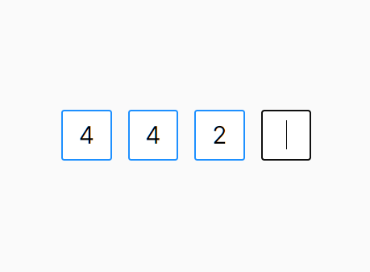

# Code Input

An unstyled and fully typed code input field with full accesibility support and simple API, for React projects. This component can be use to show input fields where you accept verificiation codes, OTPs (One Time Password) or PIN codes like the following image, or any other way that your imagination comes up with:



It provides no default styling out of the box, so that you are free to style in any way you want.

## Installation

```shell
$ npm install --save @borasemiz/code-input
```

## Usage

### Step 1: `CodeInputContainer` Component

You first bring in the `CodeInputContainer` element to the play. This component is responsible to provide wrapper around the individual character fields. When you want to change the size of this input field, you change the size of this component.

```tsx
import { CodeInputContainer } from '@borasemiz/code-input';
import styles from 'my-style-somehere.css'

function MyStyledCodeInput() {
  return (
    <CodeInputContainer className={styles['MyStyledCodeInputContainer']}>
      {/** We will put more content here... */}
    </CodeInputContainer>
  );
}
```

This component is nothing but a plain old `div` element under the hood. It has a default `position: relative` styling. Setting this CSS rule is required for the code input field to work properly. Because this is just a `div` element, this component accepts every attribute that a plain old `div` tag accepts. These attributes then transfered to the underlying `div` element that renders this component.

#### Using Another Element as Container

Because this component is a `div` under the hood, if you want to have use a different element, you need to use that element instead. If you are using a different element, make sure that element has `position: relative` in its styling. For example, the `fieldset` element as a container:

```tsx
import styles from 'my-style-somehere.css';

function MyStyledCodeInput() {
  return (
    <fieldset className={styles['MyStyledCodeInputContainer']}>
      {/** We will put more content here... */}
    </fieldset>
  );
}
```

```css
/** my-style-somewhere.css */
.MyStyledCodeInputContainer {
  position: relative;
}
```

### Step 2: `CodeInput` Component

